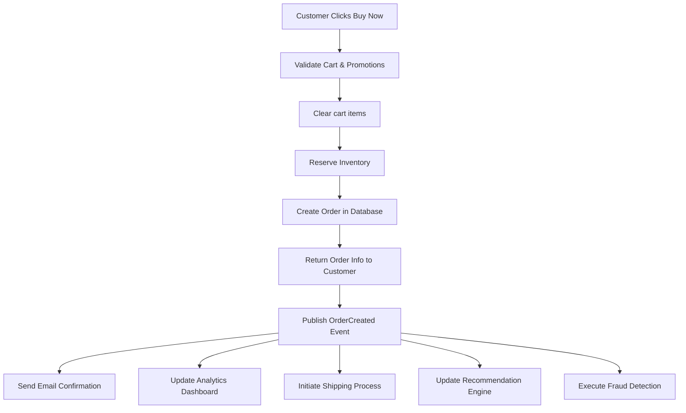

# shopnexus-remastered

[](https://wakatime.com/badge/user/592c97c4-15ad-49cb-ac34-d607be35c524/project/79f8a24e-0fe8-417e-b42b-2009d7a4362f)

## This project is under heavy development ☢️

## Epic features

### 1. Have two mode: modular monolith and microservices

- Modular monolith: all services in one process -> everything is easy 🤑
- Microservices: each service run its own process -> scaling and independent deployment, but hell for debugging 🥀

### 2. Support array in request params (separated by comma)

- Example: `/products?ids=1,2,3`
- Use sqlc.slice to filter by array of ids in sql query => faster fetching, reduce n+1 query problem

## My code, my rules

### Every day, 8 hours per day, 6 days per week

🐧

### Database

- Always use table per type (TPT) in database design
- Audit snapshot for tax authority and transaction dispute purpose
- SearchEngine(search_sync): Query event table to get the latest
- Only apply default value to fields that are most likely to be missing in insert statement (e.g. created_at, updated_at, status pending, is active, etc.)
- use SELECT ... FOR UPDATE to lock the rows when update to avoid race condition
- use SELECT ... FOR UPDATE + SKIP LOCKED in like "finding available task" to avoid multiple worker pick the same task => work best for finding available product serial in our app

### Go

- Folder structure: Vertical slice (by service)
- Use grpc generated code as domain model to reduce mapping code (<https://www.reddit.com/r/golang/comments/rdkqwv/grpc_use_the_generated_proto_as_a_model/>)
- Defensive programming, trust nothing, validate and verify everything. Fail fast, and fail early => Both transport and biz layer will validate the input

#### Always use the null.XXX

- Always use value instead of pointer (details: <https://medium.com/eureka-engineering/understanding-allocations-in-go-stack-heap-memory-9a2631b5035d>). IMO, using pointer may hard to debug in the future.
- As because of prefer value to pointer, always use the null.XXX from <https://github.com/guregu/null>.

IMO it is better than sql.NullXXX or pgtype.XXX because:

- Both not fully-compatible with validator/v10: does not have the TextUnmarshaller implemented -> won't work with query/param struct tag

### General

- No use orchestration patterns, use choreography instead.
- Use choreography pattern with compensating transactions to handle failures gracefully.
- Always use events to communicate between services to microservice friendly and avoid tight coupling.
- Use "sqids" instead of raw id to avoid data leak and make it harder to guess the total number of records. <https://sqids.org/?hashids>

#### Early stage

- Use models generated from sqlc as much as possible to coupling data with database schema, easy for development
- Only create custom model for DTOs only (response data) and some custom types that are not directly related to database schema
- #1: Show the id (the incremental primary key) in the DTO to reduce project complexity

#### Later stage

- Use generated protobuf as domain models to decouple from database schema
- Each service is a different binary, so each service can have its own model package
- Add permission checking
- #1: Hide the internal id (the incremental primary key) in the DTO to avoid data leak, use "code" (the unique public identifier) instead for external reference
- add <https://redis.io/docs/latest/develop/data-types/probabilistic/bloom-filter/>
- Outbox Pattern for reliable event publishing (kafka)

### Biz

- Tag only for SEO purpose, use category for product grouping instead.
- Handle the problem "Slowly Changing Dimension (SCD)" in database design (financial transactions related)
- Always use the sharedmodel.Currency to handle money related fields
- Use validator/v10 to validate the DTO from client side

#### Voucher abuse through partial refunds

Original Order:

Products: $100 + $200 + $300 = $600
Voucher: 60% off orders $600+
Customer pays: $240
Effective per-item cost: $40, $80, $120

After Partial Refund:

Customer keeps: $300 product
Effective price paid for $300 item: Depends on refund calculation

Common Refund Calculation Methods:
Proportional Refund (Most Fair)
   Refund = (item_price / original_total) × discount_amount
   $100 item refund = ($100/$600) × $360 = $60
   $200 item refund = ($200/$600) × $360 = $120
   Total refund = $180

Customer effectively paid: $300 - $60 = $240 for $300 item

But customer still can pay only $240 for $300 item, which is not in the first discount rule.

### Order flow



### Note

- "Interface values are comparable. Two interface values are equal if they have identical dynamic types and equal dynamic values or if both have value nil."
Which means when compare an interface value with nil, it will always return false because the "nil" is untyped nil, not typed (as the interface) nil. More details on <https://stackoverflow.com/questions/29138591/hiding-nil-values-understanding-why-go-fails-here/29138676#29138676> and <https://github.com/go-playground/validator/issues/134#issuecomment-126524931>
- Omitempty only works for pointer, slice, map, and interface types not zero value from struct.
- If you’re using pgx/v5 you get its implicit support for prepared statements. No additional sqlc configuration is required.
- struct tag "omitnil" from validator/v10 not work with untyped-nil <https://github.com/go-playground/validator/issues/1209#issuecomment-1892359649>
- Implement <https://github.com/TecharoHQ/anubis> to stop AI crawlers
- Some good middlewares (rate limiter, requestID, etc.) I should add to my echo server: <https://echo.labstack.com/docs/category/middleware>
- <https://medium.com/@zilliz_learn/elasticsearch-was-great-but-vector-databases-are-the-future-0d7ec24ab7f9>
- Add cursor pagination encode/decode into structs and use as filter conditions in queries
- Use <https://www.x402.org/> for crypto exchanging

## Develop Timeline

### 29-8-2025 🤑 First request only take 10ms 🤑


#### N+1 query btw but still blazingly fast


### 4-9-2025 Found a way to write better queries with slqc.slice

I should create a PR to sqlc.dev documentation haha

```sql
SELECT *
FROM "catalog"."product_spu"
WHERE (
    ("id" = ANY (sqlc.slice('id')))
)
```

### 5-9-2025 List products with caculated sale price (from many nested queries into 6 flat queries) only take 20ms for 10 products


### 8-9-2025 Custom type need to be registered to pgx (pgxpool.go)

Any custom DB types made with CREATE TYPE need to be registered with pgx.
<https://github.com/kyleconroy/sqlc/issues/2116>


### 13-9-2025 Nice integration of enum fields between validator/v10 validation and sqlc-generated Valid() methods

With "emit_enum_valid_method: true" in sqlc.yaml and "validateFn=Valid" in struct tag
I can validate the enum field directly with the generated Valid() method from sqlc.

```go
type CreateOrderParams struct {
 Account     authmodel.AuthenticatedAccount
 Address     string                `validate:"required"`
 OrderMethod db.OrderPaymentMethod `validate:"required,validateFn=Valid"`
 SkuIDs      []int64               `validate:"required,dive,gt=0"`
}
```

I should write a blog on this btw.

### 15-9-2025 Implement a well-structured custom Pub/Sub client for clean, maintainable publish/subscribe code

```go
// The subcriber
func (s *OrderBiz) SetupPubsub() error {
    return errutil.Some(
        s.pubsub.Subscribe("order.created", pubsub.DecodeWrap(s.OrderCreated)),
        s.pubsub.Subscribe("order.paid", pubsub.DecodeWrap(s.OrderPaid)),
    )
}

type OrderCreatedParams = struct {
    OrderID int64
}

func (s *OrderBiz) OrderCreated(ctx context.Context, params OrderCreatedParams) error {
    // code here
    
    return nil
}

type OrderPaidParams = struct {
    OrderID int64
    Amount  int64
}

func (s *OrderBiz) OrderPaid(ctx context.Context, params OrderPaidParams) error {
    // code here
    
    return nil
}

// The publisher
if err = s.pubsub.Publish("order.created", OrderCreatedParams{
    OrderID: order.ID,
}); err != nil {
    return zero, err
}
```

### 25-9-2025 First demo of recommendation engine with milvus vector search

**No more elasticsearch:**

- Elasticsearch is great, but vector databases are the future.
- After certain days with elasticsearch, found it is not suitable for vector search.
- As I remember, I was using model MGTE (alibaba) storing 200rows took 8mb of storage 💀

- Inserting into milvus took 60seconds per 100 products


### 7-10-2025 refactor payment and shipment with better interface

- Maintainer will now easier to add new payment gateway or shipment provider

```go
func (s *OrderBiz) SetupPaymentMap() error {
 var configs []sharedmodel.OptionConfig

 s.paymentMap = make(map[string]payment.Client) // map[gatewayID]payment.Client

 // setup cod client
 codClient := cod.NewClient()
 s.paymentMap[codClient.Config().ID] = codClient
 configs = append(configs, codClient.Config())

 // setup vnpay client
 vnpayClients := vnpay.NewClients(vnpay.ClientOptions{
  TmnCode:    config.GetConfig().App.Vnpay.TmnCode,
  HashSecret: config.GetConfig().App.Vnpay.HashSecret,
  ReturnURL:  config.GetConfig().App.Vnpay.ReturnURL,
 })
 for _, c := range vnpayClients {
  s.paymentMap[c.Config().ID] = c
  configs = append(configs, c.Config())
 }

 if err := s.shared.UpdateServiceOptions(context.Background(), "payment", configs); err != nil {
  return err
 }

 return nil
}
```

- Create shared service option table to store the payment and shipment options

```sql
CREATE TABLE "shared"."service_option" (
    "id" VARCHAR(100) NOT NULL,
    "category" TEXT NOT NULL,
    "name" TEXT NOT NULL,
    "description" TEXT NOT NULL,
    "provider" TEXT NOT NULL,
    "method" TEXT NOT NULL,
    "is_active" BOOLEAN NOT NULL DEFAULT true,

    CONSTRAINT "service_option_pkey" PRIMARY KEY ("id")
);
```
